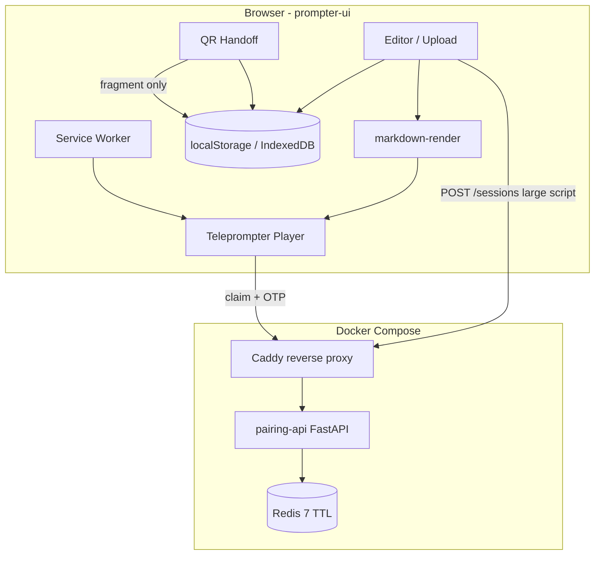

# tools-teleprompt — Full implementation plan

**Status:** Approved
**Version:** 1.0  
**Created:** 2026-05-21  
**Advanced mode:** balanced (startup-leaning — single VPS, minimal ops)  
**Foundation snapshot:** plan-master-ready 2026-05-20 · foundation-complete yes · implementation-ready no (pending Approval)  
**Plan owner:** owner / eng

---

## Executive Summary

Build a dockerized, 100% web teleprompter with device-first script storage, optional cross-device handoff (QR fragment or ephemeral relay + OTP), PWA offline support, and sanitized markdown rendering. No accounts, no database. Six milestones (M1–M6) deliver platform scaffold → markdown pipeline → prompter core → player/PWA → pairing API → QR + E2E + production hardening. Top risks: XSS via markdown (R6), relay token/OTP abuse (R4–R5), localStorage quota (R7). References foundation doc 04, ADRs 001–005, and feature SPECs under `.work/features/`.

---

## Project Goals

| Goal | Success metric |
|------|----------------|
| G1 — Usable teleprompter on any device | User completes J1 (same-device present) in ≤2 min on mobile |
| G2 — Optional cross-device handoff | J2 (relay) and J2b (QR) complete end-to-end in Playwright smoke |
| G3 — Privacy-first | No script content in server logs; relay delete-on-read; QR path serverless |
| G4 — Offline-capable PWA | Prompter works offline after first load with local script (NFR-04) |
| G5 — Safe rich display | XSS fixture corpus passes; CSP deployed (NFR-03) |
| G6 — Simple ops | Single Compose stack on VPS; no DB migrations |

---

## Functional Requirements

| ID | Requirement | Source | Milestone |
|----|-------------|--------|-----------|
| FR-01 | Script capture: paste, type, upload `.txt`/`.md`; size validated; format selected | scope §FR-01, prompter-ui R1 | M3 |
| FR-02 | Markdown renders as sanitized HTML; plain as escaped pre-wrapped text | scope §FR-02, markdown-render | M2 |
| FR-03 | Script + settings persist in browser storage across reload | scope §FR-03, prompter-ui R2 | M3 |
| FR-04 | Player: speed, play/pause, fullscreen, mirror, theme, wake lock | scope §FR-04, prompter-ui R3–R5 | M4 |
| FR-05 | Cross-device relay: create session → URL + OTP → claim → delete-on-read | scope §FR-05, pairing-api | M5 |
| FR-06 | Cross-device QR: fragment payload ≤ threshold; no server body | scope §FR-06, prompter-ui R9 | M6 |
| FR-07 | Direct mobile entry skips OTP/pairing | scope §FR-07, prompter-ui R11 | M3 |
| FR-08 | Max script size enforced client + server (relay path) | scope §FR-08 | M3, M5 |
| FR-09 | PWA offline: app shell + offline prompter with local script | scope §FR-09, prompter-ui R8 | M4 |
| FR-10 | Responsive layout; installable where supported | scope §FR-10 | M3, M4 |

---

## Non-Functional Requirements

| ID | Requirement | Target | Milestone |
|----|-------------|--------|-----------|
| NFR-01 | Privacy | Script on device after handoff; relay TTL 300s; no content logs | M5, M6 |
| NFR-02 | Performance | Smooth scroll ≥30 fps on mid-tier mobile with 64 KB markdown | M4 |
| NFR-03 | Security | Sanitized HTML; CSP; rate limits; OTP lockout | M2, M5, M6 |
| NFR-04 | Offline | App shell cached; prompter offline with local script | M4 |
| NFR-05 | Simplicity | No DB; ≤3 Compose services (frontend static, api, redis, proxy) | M1 |
| NFR-06 | Availability | Single-instance VPS; health check; Redis required for relay only | M1, M5 |
| NFR-07 | Accessibility | Keyboard shortcuts (desktop); focus visible; WCAG 2.1 AA contrast for UI chrome | M4 |
| NFR-08 | Cost | Single VPS + domain; no managed DB | M1 |
| NFR-09 | i18n | English UI v1; strings externalized for future | M3 |
| NFR-10 | Observability | Structured logs; pairing counters per observability-spec | M5, M6 |

---

## Constraints

| ID | Constraint | Source |
|----|------------|--------|
| C1 | No user accounts or authentication system | owner P0, ADR 004 |
| C2 | No SQL/NoSQL database | owner P0, ADR 002 |
| C3 | Docker Compose deployment | owner P0, ADR 003 |
| C4 | Script content must not appear in logs | `.cursorrules`, pairing-api R11 |
| C5 | Markdown HTML output must pass DOMPurify allowlist | ADR 005 |
| C6 | Application code follows `.ai/standards/20260520-CONVENTIONS.md` | P4 |
| C7 | Feature work governed by SPECs in `.work/features/` | FEATURE_STANDARD |
| C8 | Agent-assisted code requires MOD-06 concept run per SPEC | markdown-render §13 |

---

## Assumptions

Canonical registry: `.work/plans/ASSUMPTIONS.md` (A1–A19 confirmed/inference).

**Plan additions:**

| ID | Assumption | Label |
|----|------------|-------|
| A20 | CI platform: **GitHub Actions** (resolves U6 default for v1) | Inference — owner may override |
| A21 | QR threshold: **8192 bytes** compressed fragment (resolves U8 default) | Inference — owner may override |
| A22 | Max script size: **262144 bytes** (256 KB) per U1 default | Inference |
| A23 | Compose files committed in M1 after owner `approve compose` or plan Approval waiver W4 | Confirmed — HANDOFF W4 |

---

## Risks

Canonical registry: `.work/plans/RISK_REGISTRY.md`.

**Top risks for implementation (see registry for full list):**

| ID | Risk | Mitigation task |
|----|------|-----------------|
| R4 | Token/URL leak | M5-T2: 128-bit CSPRNG tokens; M5-T4: delete-on-read |
| R5 | Session-create abuse | M5-T3: rate limits; M1-T6: max body size config |
| R6 | XSS via markdown | M2-T1–T3: markdown-it `html:false` + DOMPurify + fixture tests |
| R7 | localStorage quota | M3-T4: IndexedDB fallback; clear UX |
| R9 | QR exceeds capacity | M6-T1: auto-fallback to relay |
| R10 | Stale service worker | M4-T5: vite-plugin-pwa update strategy |

---

## Unknowns / Open Questions

Canonical registry: `.work/plans/UNKNOWNS.md`.

| ID | Status in plan | Resolution |
|----|--------------|------------|
| U1 | Default accepted | 256 KB — env `API_MAX_SCRIPT_BYTES=262144` |
| U6 | Default proposed | GitHub Actions — `.github/workflows/ci.yml` in M1 |
| U8 | Default proposed | 8192 bytes compressed — constant in `frontend/src/pairing/qrThreshold.ts` |

Owner may override U1/U6/U8 before M1 Approval; document override in Decision log.

---

## Architecture Overview

References: `.work/plans/foundation/20260520-04-foundation-architecture.md`, ADRs 001–005, `.ai/standards/20260520-DIRECTORY_MAP.md`.

### Bounded contexts

| Context | Path | Responsibility |
|---------|------|----------------|
| prompter-ui | `frontend/` | SPA: editor, player, PWA, QR, pairing client |
| markdown-render | `frontend/src/markdown/` | Parse + sanitize (implements SPEC) |
| pairing-api | `api/src/pairing/` | Ephemeral session relay |
| platform | `api/src/platform/` | Config, logging, rate limit, Redis client |

**Dependency rule:** `frontend/` → HTTP → `pairing-api` → `platform`. No reverse imports. No shared DB.

### System diagram



### Data flow — relay handoff (J2)

1. Desktop: `POST /api/v1/sessions` with `{ text, format }`.
2. API stores JSON in Redis (TTL 300s); returns `{ token, otp, claim_url, expires_at }`.
3. Mobile: open `claim_url`, enter OTP, `POST .../claim`.
4. API returns script once; deletes Redis key atomically.
5. Mobile persists to localStorage; enters player.

### Data flow — QR handoff (J2b)

1. Desktop: compress + encode script in URL **fragment** (≤ 8 KB).
2. Mobile: scan QR or open link; fragment parsed client-side only.
3. Script saved to localStorage; no API call for body.

---

## UX/UI Strategy

References: prompter-ui SPEC, foundation doc 04 §5, ADR 001 (English v1).

### UX philosophy

- **Zero signup:** first screen is script entry or player (if script exists locally).
- **Progressive disclosure:** pairing/OTP screens only on relay handoff route.
- **Mobile-first player:** large touch targets; minimal chrome in fullscreen.
- **Fail clearly:** size limits, offline, OTP lockout — plain language errors.

### Information architecture

| Route | Purpose |
|-------|---------|
| `/` | Home: editor or resume player |
| `/play` | Fullscreen player |
| `/handoff/create` | Choose QR vs relay; show OTP/QR |
| `/handoff/claim/:token` | OTP entry (relay only) |
| `/settings` | Speed defaults, theme, help |

### Responsive standards

- Breakpoints: mobile `<768px`, tablet `768–1024px`, desktop `>1024px`.
- Player font size: user-adjustable; default 24px mobile / 28px desktop.
- Safe-area insets for notched devices in fullscreen.

### States

| State | Pattern |
|-------|---------|
| Empty | Prompt to paste or upload with drag-drop zone |
| Loading | Skeleton for player init only |
| Error | Inline banner + retry where applicable |
| Offline | Badge when `navigator.onLine === false`; pairing disabled |

### Accessibility

- Keyboard shortcuts per prompter-ui R12.
- Focus rings on interactive controls.
- Contrast ratio ≥4.5:1 for UI text (NFR-07).

---

## Data Strategy

| Topic | Decision |
|-------|----------|
| Database | **None** (v1) — N/A |
| Client persistence | `localStorage` primary; IndexedDB fallback when quota exceeded |
| Server persistence | Redis ephemeral keys only; TTL 300s; delete-on-read |
| Schema migrations | N/A — no SQL |
| Retention | Scripts live on user device indefinitely (user-controlled clear) |
| Classification | Script = sensitive user content; device-local after load |

---

## Security Strategy

References: `.ai/standards/20260520-threat-model.md`, ADR 005, pairing-api SPEC §10.

| Area | Control |
|------|---------|
| Markdown XSS | markdown-it `html: false`; DOMPurify allowlist; single `SanitizedHtml` component |
| CSP | `default-src 'self'`; restrict script sources; report-only phase optional M6 |
| Relay auth | Unguessable token (128-bit) + 6-digit OTP; 5 attempt lockout |
| Rate limiting | 10 creates / 20 claims per IP per 15 min (configurable) |
| Headers | `X-Content-Type-Options: nosniff`, `Referrer-Policy: strict-origin-when-cross-origin` |
| Secrets | Env vars only; never in repo; Redis internal network |
| Logging | Event types only — no script, OTP, token, fragment payload |
| QR fragment | Same-origin; not logged; size cap |

---

## Infrastructure Strategy

References: ADR 003, `DOCS_TECH_STACK.md`, deploy proposal (P5).

| Component | Choice |
|-----------|--------|
| Hosting | Single VPS or container host |
| Orchestration | Docker Compose v2 |
| Reverse proxy | Caddy 2.9 (TLS termination, static + API routing) |
| Frontend delivery | Built static assets served by Caddy or dedicated nginx container |
| Ephemeral store | Redis 7.4-alpine — internal network only (R11 mitigated) |
| Environments | `local` (compose), `production` (compose on VPS) |
| DNS | Owner-managed; HTTPS required for PWA install |

---

## Deployment Strategy

| Phase | Approach |
|-------|----------|
| Local dev | `bin/start.sh` → `deploy/docker-compose.yml` |
| CI | GitHub Actions: lint, typecheck, unit tests on PR (U6 default) |
| Production | `docker compose pull && docker compose up -d` on VPS |
| Rollout | Single instance; no blue/green v1 — brief downtime acceptable |
| Secrets | `.env` on host; not in git |
| Static assets | Frontend build baked into image or volume mount at deploy |

Compose commit gated by owner W4 waiver or explicit Approval note.

---

## Scalability Strategy

v1 targets **single-instance** deployment (ADR 004, A17).

| Bottleneck | v1 approach | Future |
|------------|-------------|--------|
| API throughput | Single uvicorn worker; low traffic expected | Horizontal replicas + shared Redis |
| Redis memory | Max script 256 KB × concurrent sessions; TTL 5 min | Monitor memory; cap concurrent sessions |
| Static assets | CDN optional | Cloudflare in front of Caddy |
| Client render | Virtualize long scripts if perf issue | Deferred |

No queue or event bus in v1.

---

## Observability Strategy

References: `.ai/standards/20260520-observability-spec.md`.

| Signal | Implementation |
|--------|----------------|
| Logs | Structured JSON (platform/logging.py); request_id per request |
| Metrics | Counters: `pairing.session.created`, `pairing.session.claimed`, `pairing.session.expired`, `pairing.session.locked` |
| Traces | N/A v1 — defer OpenTelemetry |
| SLO | `/health` returns 200 when Redis reachable; 503 otherwise |
| Client metrics | Optional: `handoff.qr.generated`, `player.started` — no script content |
| Dashboards | N/A v1 — log grep / simple Prometheus optional post-v1 |

---

## Testing Strategy

| Layer | Tool | Gate |
|-------|------|------|
| Unit (FE) | vitest | Task gate — every M2+ frontend task |
| Unit (API) | pytest + fakeredis | Task gate — every M5+ API task |
| XSS fixtures | vitest + `xss-fixtures.json` | M2 milestone gate |
| Integration | pytest API routes | M5 milestone gate |
| E2E | Playwright | M6 milestone gate — relay + QR smoke |
| PWA offline | Playwright offline mode | M4 milestone gate |
| Lint | eslint (FE), ruff (API) | CI on every PR |
| Typecheck | tsc strict (FE), pyright (API) | CI on every PR |

Coverage target: ≥80% on `frontend/src/markdown/` and `api/src/pairing/` (measured at M6).

---

## Operational Strategy

| Topic | v1 approach |
|-------|-------------|
| Runbooks | `deploy/README.md`: start, stop, logs, Redis flush |
| Incidents | P1: site down; P2: relay broken; P3: XSS report |
| On-call | Owner/eng — no pager v1 |
| Backups | None required (no durable user data on server) |
| Redis | Ephemeral — loss acceptable; sessions recreated |
| Updates | Pull image/tag; restart compose; SW updates client-side |
| Abuse response | Rate limit tuning; optional CAPTCHA deferred (foundation §14) |

---

## Incremental Execution Roadmap

### M1: Platform scaffold and dev stack

**Objective:** Runnable monorepo skeleton with Docker Compose, platform module, CI baseline, and agent-rule token resolution.

**Scope in:** `frontend/`, `api/`, `deploy/`, `bin/start.sh`, `.github/workflows/`, `.cursorrules` token fill  
**Scope out:** Feature UI, pairing logic, PWA

**Dependencies:** plan Approval or HANDOFF M1 waiver; owner `approve compose` (W4)

**Deliverables:** Empty apps that build/test; health endpoint; compose up

**Acceptance criteria:** `docker compose up` healthy; `pytest` and `npm test` pass smoke; CI green on empty suites

**Validation steps:** `docker compose -f deploy/docker-compose.yml ps`; API `GET /health`; frontend dev server builds

**Rollback considerations:** Remove compose services; revert scaffold commit

**Testing requirements:** Smoke tests only

**Complexity:** M

**Operational impact:** Establishes deploy topology

#### Tasks — M1: Platform scaffold

| ID | Description | Files | FR/NFR | Complexity | Status |
|----|-------------|-------|--------|------------|--------|
| M1-T1 | Scaffold `frontend/` Vite 6 + React 19 + TS strict; empty App | `frontend/package.json`, `frontend/vite.config.ts`, `frontend/src/App.tsx`, `frontend/tsconfig.json` | NFR-05 | M | pending |
| M1-T2 | Scaffold `api/` FastAPI + uvicorn; package layout per DIRECTORY_MAP | `api/pyproject.toml`, `api/src/platform/config.py`, `api/src/main.py` | NFR-05 | M | pending |
| M1-T3 | Implement `GET /health` with Redis ping stub (optional fail if no Redis) | `api/src/platform/health.py`, `api/src/main.py` | NFR-06 | S | pending |
| M1-T4 | Add `deploy/docker-compose.yml`, Dockerfiles, Caddyfile; internal Redis network | `deploy/docker-compose.yml`, `deploy/Caddyfile`, `frontend/Dockerfile`, `api/Dockerfile` | NFR-05, NFR-08 | M | pending |
| M1-T5 | Add `bin/start.sh` wrapper; document in README | `bin/start.sh`, `README.md` | NFR-05 | S | pending |
| M1-T6 | Platform logging (structured JSON) + env config for limits/TTL | `api/src/platform/logging.py`, `api/src/platform/config.py` | NFR-10 | S | pending |
| M1-T7 | GitHub Actions CI: FE lint/typecheck/test + API ruff/pyright/pytest | `.github/workflows/ci.yml` | U6, NFR-03 | M | pending |
| M1-T8 | Fill `.cursorrules` REPLACE tokens for APP_ROOT, TEST/LINT/TYPECHECK, compose service names | `.cursorrules` | W1 | S | pending |

---

### M2: Markdown render pipeline

**Objective:** Safe markdown → HTML pipeline with XSS test corpus.

**Scope in:** `frontend/src/markdown/`, tests, `SanitizedHtml` component  
**Scope out:** Full prompter UI, pairing

**Dependencies:** M1 complete

**Deliverables:** `renderScript()` API per markdown-render SPEC

**Acceptance criteria:** All SPEC R1–R8 tests pass; XSS fixtures do not execute

**Validation steps:** `cd frontend && npm test -- markdown`

**Rollback considerations:** Feature flag `format=plain` only in settings

**Testing requirements:** vitest + xss-fixtures.json

**Complexity:** M

**Operational impact:** None (client-only)

#### Tasks — M2: Markdown render

| ID | Description | Files | FR/NFR | Complexity | Status |
|----|-------------|-------|--------|------------|--------|
| M2-T1 | Implement `renderScript(source, format)` with markdown-it `html:false` | `frontend/src/markdown/render.ts`, `frontend/src/markdown/types.ts` | FR-02, NFR-03 | M | pending |
| M2-T2 | DOMPurify allowlist + link `rel`/`target` attrs per SPEC R4–R6 | `frontend/src/markdown/sanitize.ts` | FR-02, NFR-03 | M | pending |
| M2-T3 | `SanitizedHtml` React choke-point component | `frontend/src/markdown/SanitizedHtml.tsx` | FR-02 | S | pending |
| M2-T4 | Plain-text escape path (no parse) | `frontend/src/markdown/plain.ts` | FR-02 | S | pending |
| M2-T5 | XSS fixture corpus ≥10 vectors + vitest suite | `frontend/tests/xss-fixtures.json`, `frontend/tests/markdown.test.ts` | NFR-03, R6 | M | pending |
| M2-T6 | Run `@concept-run - MOD-06`; attach output to PR notes | `.work/plans/NEXT.md` concept registry | NFR-03 | S | pending |

---

### M3: Prompter UI core

**Objective:** Script editor, settings, local persistence, responsive shell, same-device flow (FR-07).

**Scope in:** Editor, storage, routing, size validation  
**Scope out:** Player scroll engine, PWA, pairing

**Dependencies:** M2 complete

**Deliverables:** Working editor → storage → plain/markdown preview

**Acceptance criteria:** prompter-ui SPEC R1–R2, R7, R11 pass tests

**Validation steps:** vitest + manual mobile viewport check

**Rollback considerations:** Revert storage keys with migration note in changelog

**Testing requirements:** vitest component tests

**Complexity:** L

**Operational impact:** None

#### Tasks — M3: Prompter core

| ID | Description | Files | FR/NFR | Complexity | Status |
|----|-------------|-------|--------|------------|--------|
| M3-T1 | React Router routes: `/`, `/play`, `/settings`, `/handoff/*` | `frontend/src/App.tsx`, `frontend/src/routes/` | FR-10 | M | pending |
| M3-T2 | Script editor: paste, type, drag-drop upload `.txt`/`.md` | `frontend/src/prompter/Editor.tsx` | FR-01 | M | pending |
| M3-T3 | Format selector `plain` \| `markdown`; preview via markdown-render | `frontend/src/prompter/Preview.tsx` | FR-01, FR-02 | M | pending |
| M3-T4 | localStorage persistence + IndexedDB fallback; keys per SPEC §5 | `frontend/src/prompter/storage.ts` | FR-03, R7 | M | pending |
| M3-T5 | Settings panel: speed, font, theme, mirror defaults | `frontend/src/prompter/Settings.tsx` | FR-03 | S | pending |
| M3-T6 | Client-side max size validation (256 KB default) | `frontend/src/prompter/limits.ts` | FR-08 | S | pending |
| M3-T7 | Responsive layout shell; mobile-first CSS | `frontend/src/prompter/Layout.tsx`, `frontend/src/styles/` | FR-10 | M | pending |
| M3-T8 | i18n string externalization stub (English) | `frontend/src/lib/i18n/en.ts` | NFR-09 | S | pending |

---

### M4: Player and PWA

**Objective:** Full teleprompter player with offline-capable PWA shell.

**Scope in:** Scroll engine, controls, PWA, wake lock  
**Scope out:** Pairing, QR

**Dependencies:** M3 complete

**Deliverables:** Installable PWA; offline prompter with local script

**Acceptance criteria:** prompter-ui R3–R8, R12; Playwright offline test pass

**Validation steps:** Lighthouse PWA audit (manual); Playwright offline scenario

**Rollback considerations:** Disable service worker via env flag

**Testing requirements:** vitest + Playwright offline

**Complexity:** L

**Operational impact:** SW update strategy affects users (R10)

#### Tasks — M4: Player and PWA

| ID | Description | Files | FR/NFR | Complexity | Status |
|----|-------------|-------|--------|------------|--------|
| M4-T1 | Teleprompter player: auto-scroll, speed slider 0.5×–3× | `frontend/src/prompter/Player.tsx`, `frontend/src/prompter/useScroll.ts` | FR-04, NFR-02 | L | pending |
| M4-T2 | Play/pause, font size, light/dark theme, horizontal mirror | `frontend/src/prompter/PlayerControls.tsx` | FR-04 | M | pending |
| M4-T3 | Fullscreen API + Screen Wake Lock during playback | `frontend/src/prompter/useFullscreen.ts`, `frontend/src/prompter/useWakeLock.ts` | FR-04 | M | pending |
| M4-T4 | PWA manifest + vite-plugin-pwa; precache app shell | `frontend/vite.config.ts`, `frontend/public/manifest.webmanifest` | FR-09, NFR-04 | M | pending |
| M4-T5 | Service worker update UX (prompt reload on new version) | `frontend/src/pwa/registerSW.ts` | FR-09, R10 | M | pending |
| M4-T6 | Keyboard shortcuts: space, +/-, f; help panel | `frontend/src/prompter/Help.tsx`, `frontend/src/prompter/useKeyboard.ts` | FR-04, NFR-07 | S | pending |
| M4-T7 | Playwright: offline prompter with cached script | `frontend/tests/e2e/offline.spec.ts` | FR-09 | M | pending |

---

### M5: Pairing API and relay handoff

**Objective:** Ephemeral relay with OTP; frontend relay client; delete-on-read.

**Scope in:** pairing-api full SPEC, Redis, rate limits, handoff UI (relay path)  
**Scope out:** QR fragment path

**Dependencies:** M1 complete (M3–M4 recommended for integrated UX)

**Deliverables:** Working J2 user journey

**Acceptance criteria:** pairing-api SPEC R1–R11; pytest integration suite pass

**Validation steps:** `pytest tests/pairing/`; manual relay handoff

**Rollback considerations:** Disable `/api/v1/sessions` route via feature flag env

**Testing requirements:** pytest + fakeredis; integration tests

**Complexity:** L

**Operational impact:** Redis required for relay; metrics emitted

#### Tasks — M5: Pairing API

| ID | Description | Files | FR/NFR | Complexity | Status |
|----|-------------|-------|--------|------------|--------|
| M5-T1 | Redis client wrapper + key pattern `pairing:session:{token}` | `api/src/platform/redis.py` | FR-05, NFR-05 | S | pending |
| M5-T2 | Session create: validate size, CSPRNG token, OTP hash, TTL 300s | `api/src/pairing/service.py`, `api/src/pairing/models.py` | FR-05, FR-08, R4 | L | pending |
| M5-T3 | Rate limiter middleware per IP | `api/src/platform/rate_limit.py` | NFR-03, R5 | M | pending |
| M5-T4 | Claim endpoint: OTP verify, atomic delete, lockout after 5 fails | `api/src/pairing/routes.py`, `api/src/pairing/service.py` | FR-05, R4 | L | pending |
| M5-T5 | RFC 7807 error responses; no script in logs | `api/src/platform/errors.py` | NFR-01, NFR-03 | S | pending |
| M5-T6 | Pairing metrics counters | `api/src/pairing/metrics.py` | NFR-10 | S | pending |
| M5-T7 | pytest suite: create, claim, expire, lockout, 410 second claim | `api/tests/pairing/` | FR-05 | L | pending |
| M5-T8 | Frontend relay client + handoff create/claim UI | `frontend/src/pairing/client.ts`, `frontend/src/pairing/HandoffCreate.tsx`, `frontend/src/pairing/HandoffClaim.tsx` | FR-05, FR-07 | L | pending |
| M5-T9 | Cross-model review of pairing-api + security paths (W3) | review notes in PR | W3, R4 | S | pending |

---

### M6: QR handoff, E2E, and production hardening

**Objective:** QR fragment handoff, full E2E coverage, CSP deployment, production docs.

**Scope in:** QR encode/decode, E2E, CSP, deploy runbook  
**Scope out:** CAPTCHA, multi-region, DOCX import

**Dependencies:** M4, M5 complete

**Deliverables:** J2b QR journey; production-ready deploy docs

**Acceptance criteria:** Playwright relay + QR smoke; CSP headers live; deploy README complete

**Validation steps:** `npx playwright test`; curl CSP headers

**Rollback considerations:** QR disabled → relay-only fallback (M6-T1)

**Testing requirements:** Full E2E suite

**Complexity:** L

**Operational impact:** Production deploy procedure documented

#### Tasks — M6: QR and hardening

| ID | Description | Files | FR/NFR | Complexity | Status |
|----|-------------|-------|--------|------------|--------|
| M6-T1 | QR threshold constant (8192 B); auto-fallback to relay when over | `frontend/src/pairing/qrThreshold.ts`, `frontend/src/pairing/HandoffCreate.tsx` | FR-06, R9, U8 | M | pending |
| M6-T2 | QR generate (qrcode lib) + fragment encode/decode | `frontend/src/pairing/qrEncode.ts`, `frontend/src/pairing/qrDecode.ts` | FR-06 | M | pending |
| M6-T3 | QR consume route: parse fragment → localStorage → player | `frontend/src/pairing/QrConsume.tsx` | FR-06, FR-07 | M | pending |
| M6-T4 | Playwright E2E: relay handoff (J2) + QR handoff (J2b) | `frontend/tests/e2e/handoff-relay.spec.ts`, `frontend/tests/e2e/handoff-qr.spec.ts` | FR-05, FR-06 | L | pending |
| M6-T5 | CSP + security headers in Caddy/production config | `deploy/Caddyfile`, `.ai/standards/20260520-threat-model.md` cross-check | NFR-03 | M | pending |
| M6-T6 | Cross-model review: markdown-render + ADR 005 (W3) | review notes in PR | W3, R6 | S | pending |
| M6-T7 | Production runbook + env example | `deploy/README.md`, `.env.example` | NFR-06 | S | pending |
| M6-T8 | Resolve UNKNOWNS U1/U6/U8 in registry or confirm defaults | `.work/plans/UNKNOWNS.md` | U1, U6, U8 | S | pending |
| M6-T9 | `@code-verify milestone` prep; global acceptance checklist | `.work/plans/NEXT.md` | §20 | S | pending |

---

## Acceptance Criteria (global)

| # | Criterion | Verification |
|---|-----------|--------------|
| AC-1 | User completes same-device present (J1) without network after first load | Playwright offline + manual |
| AC-2 | Relay handoff (J2) completes; server key deleted after claim | pytest + E2E |
| AC-3 | QR handoff (J2b) completes without API body transfer | E2E + network tab audit |
| AC-4 | Markdown XSS corpus passes | M2 tests |
| AC-5 | Max script 256 KB enforced client + server | unit tests |
| AC-6 | No script/OTP/token in API logs | log review test / manual grep |
| AC-7 | PWA installable; offline shell loads | Lighthouse / manual |
| AC-8 | CI green on main: lint, typecheck, unit, E2E | GitHub Actions |
| AC-9 | `docker compose up` documented and working | deploy README |
| AC-10 | All FR-01–FR-10 traced to done tasks | traceability matrix |

---

## Validation Gates

| Milestone | Commands (from repo root / compose) | Must pass |
|-----------|-------------------------------------|-----------|
| M1 | `docker compose -f deploy/docker-compose.yml up -d`; `curl localhost/health` | health 200 |
| M1 | `cd api && pytest tests/ -q`; `cd frontend && npm test` | exit 0 |
| M2 | `cd frontend && npm test -- markdown` | exit 0 |
| M3 | `cd frontend && npm test -- prompter` | exit 0 |
| M4 | `cd frontend && npx playwright test offline` | exit 0 |
| M5 | `cd api && pytest tests/pairing/ -q` | exit 0 |
| M6 | `cd frontend && npx playwright test` | exit 0 |
| M6 | `@code-verify milestone` | pass |

Per `.cursorrules`, run API/FE tests in compose when stack is canonical:

```bash
docker compose -f deploy/docker-compose.yml exec api bash -c "cd /app && pytest tests/ -q"
docker compose -f deploy/docker-compose.yml exec frontend bash -c "cd /app && npm test"
```

---

## Rollback and Recovery Considerations

| Milestone | Rollback strategy |
|-----------|-------------------|
| M1 | Revert scaffold; no user data affected |
| M2 | Disable markdown format in settings (plain only) |
| M3 | Clear breaking storage key change with one-time migration or version bump |
| M4 | Unregister service worker; users get online-only until refresh |
| M5 | Set `PAIRING_ENABLED=false` env; hide handoff UI |
| M6 | QR fallback to relay already built-in; CSP can revert to report-only |

Redis flush safe (ephemeral only). No DB migrations to reverse.

---

## Technical Debt Prevention Strategy

| Pressure point | Policy |
|----------------|--------|
| Duplicated sanitize logic | Single `markdown-render` module — no inline DOMPurify elsewhere |
| God components | Split editor/player/pairing per DIRECTORY_MAP |
| Magic constants | Centralize limits in config/env + `qrThreshold.ts` |
| Skipped tests | Task gate blocks `done` without test evidence |
| Debt ledger | Record deferrals in `.work/plans/NEXT.md` Done/Notes; no silent TODOs |

Refactor budget: one cleanup task per milestone max (defer to M6 if needed).

---

## AI-Agent Execution Guidance

References: `.cursorrules`, `@code-implementation` skill, `@concept-run - MOD-06`.

### Architectural invariants (never violate)

1. No script content in logs, metrics labels, or HANDOFF.
2. Markdown → DOM only through `SanitizedHtml` / `renderScript`.
3. `pairing-api` delete-on-read — no listing endpoints.
4. No database tables or ORM in v1.
5. Dependency direction: frontend → API → platform only.

### Dangerous paths (model tier **strong** + cross-model review)

| Path | Tasks | Review |
|------|-------|--------|
| OTP + token security | M5-T2, M5-T4 | W3 cross-model before merge |
| Markdown XSS | M2-T1–T5 | W3 cross-model before merge |
| Rate limiting | M5-T3 | standard tier |

### Model tier hints

| Tier | Typical tasks |
|------|---------------|
| light | M1-T5, M3-T8, M6-T7, config/docs |
| standard | M3-T2, M4-T2, M5-T5, UI components |
| strong | M2-T1–T2, M5-T2, M5-T4, M6-T5 |

### Implementer checklist (from session-control start)

1. Read feature SPEC before editing.
2. Run task gate: tests + lint + typecheck + secrets scan.
3. Run MOD-06 for agent-assisted diffs.
4. Update NEXT.md task status on complete.

---

## Long-Term Maintainability Strategy

| Topic | Approach |
|-------|----------|
| Ownership | eng maintains app; owner approves scope changes |
| Doc upkeep | SPECs amended via `@feature-spec`; plan via `@plan-master revise` |
| Deprecation | v2 features get ADR before code; v1 APIs versioned under `/api/v1/` |
| Dependency updates | Quarterly pin review in `DOCS_TECH_STACK.md` |
| Architecture review | After M6 ship; before any multi-instance deploy |
| Onboarding | README + START_HERE + this plan §19 task tables |

---

## Decision log

| ID | Date | Decision | Alternatives rejected |
|----|------|----------|----------------------|
| D1 | 2026-05-20 | React + Vite + FastAPI stack | Next.js (heavier), Node API (less owner familiarity) — ADR 001 |
| D2 | 2026-05-20 | Redis ephemeral relay | In-memory only (breaks multi-instance), Postgres (violates no-DB) — ADR 002 |
| D3 | 2026-05-20 | Docker Compose on VPS | K8s (overkill v1), serverless (conflicts with Redis relay) — ADR 003 |
| D4 | 2026-05-20 | Single public instance, no tenancy | Multi-tenant (out of scope) — ADR 004 |
| D5 | 2026-05-20 | markdown-it + DOMPurify pipeline | Raw HTML markdown (XSS), plain-only (owner rejected) — ADR 005 |
| D6 | 2026-05-21 | Six milestones M1–M6 incremental delivery | Big-bang single milestone (harder to verify) |
| D7 | 2026-05-21 | GitHub Actions for CI (U6 default) | GitLab CI, CircleCI — defer unless owner overrides |
| D8 | 2026-05-21 | QR threshold 8192 bytes compressed (U8 default) | 4 KB (too small), 16 KB (QR capacity risk) |
| D9 | 2026-05-21 | Max script 256 KB (U1 default) | 64 KB (too restrictive), 1 MB (abuse surface) |
| D10 | 2026-05-21 | English-only UI v1 with i18n stub | Full i18n v1 (scope creep) |

---

## Traceability matrix

Full matrix: [20260521-full-plan-trace.md](./20260521-full-plan-trace.md)

Summary coverage:

| Goal | FR | ADR | SPEC | Primary tasks | Test |
|------|-----|-----|------|---------------|------|
| G1 | FR-01,03,04,07 | 001 | prompter-ui | M3-T2, M4-T1 | M4-T7, AC-1 |
| G2 | FR-05,06 | 002 | pairing-api, prompter-ui | M5-T8, M6-T2 | M6-T4, AC-2,3 |
| G3 | FR-05,06,08 | 002,004 | pairing-api | M5-T4, M6-T3 | M5-T7, AC-6 |
| G4 | FR-09 | 001 | prompter-ui | M4-T4, M4-T5 | M4-T7, AC-7 |
| G5 | FR-02 | 005 | markdown-render | M2-T1–T5 | M2-T5, AC-4 |
| G6 | — | 003 | — | M1-T4, M6-T7 | AC-9 |

**FR traceability:** FR-01–FR-10 each map to ≥1 task (see trace file). **Gap:** none at plan time.

---

## Registries reference

- Assumptions: `.work/plans/ASSUMPTIONS.md`
- Risks: `.work/plans/RISK_REGISTRY.md`
- Unknowns: `.work/plans/UNKNOWNS.md`

---

## Phase 5 — Integrity validation (plan-master)

| Check | Result | Evidence |
|-------|--------|----------|
| Plan vs ADRs | pass | Stack, Redis, deploy, tenancy, sanitize align with 001–005 |
| Plan vs SPECs | pass | Task files match SPEC boundaries; no duplicate pairing in prompter-ui |
| Plan vs foundation doc 04 | pass | Contexts, handoff modes, PWA scope consistent |
| Scope vs P0/P1 | pass | FR-01–10 cover scope doc; out-of-scope items not tasked |
| Architecture fitness | pass | DIRECTORY_MAP dependency rules respected |
| Security | pass | R4–R6 mitigations mapped to M2, M5, M6 tasks |
| Ops readiness | pass | M1 deploy + M6 runbook |
| Agent executability | pass | Tasks have file paths + FR/NFR links |
| Unverified claims | pass with waivers | U1/U6/U8 defaults documented; W3 cross-model deferred to M5-T9, M6-T6 |
| Hallucination review | pass | Stack pins from DOCS_TECH_STACK.md; no invented vendor APIs |

**Integrity score:** pass with waivers (W3 cross-model review at implementation; W4 compose commit at M1)

**Approval gate:** Plan remains **Draft** until owner sets **Approved** in header and HANDOFF records sign-off.

---

## Changelog

| Version | Date | Change |
|---------|------|--------|
| 1.0 | 2026-05-21 | Initial master plan (greenfield) |
